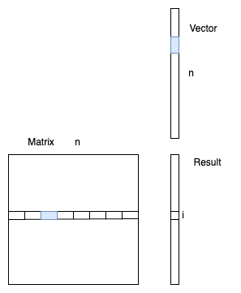
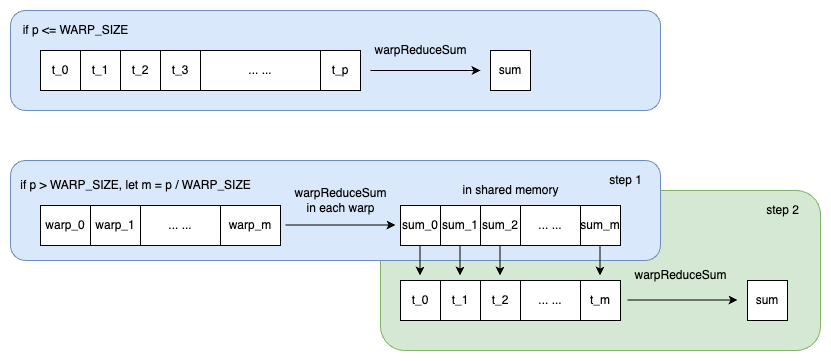
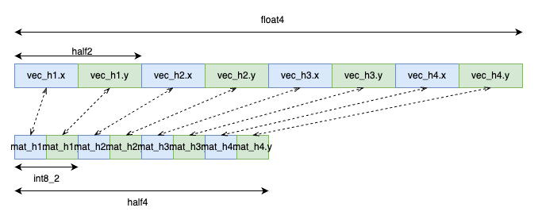
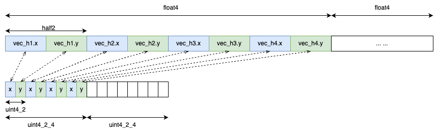
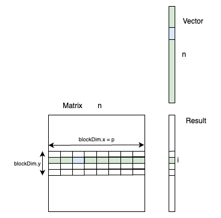
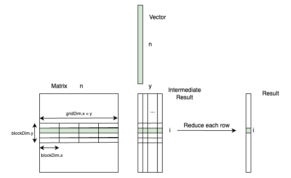

# Method and Result

## Optimization Strategies

### P threads per dot product

Rather than assigning a single thread to compute each component of the result vector, we propose an optimization technique using `p` threads per dot product. In this approach, each thread is responsible for processing `size / p` elements in both the matrix and the vector, while `p` threads collectively handle the computation for a single row.

The following diagram provides an overview of our algorithm:



As shown in the above image, in each row, `p` threads (here `p`=8) compute one section of the dot product, and then the partial results are added together to obtain one value of `result[i]`.

Consequently, the problem can be divided into two key aspects:

- Optimizing the computation time of generating partial results within an individual thread.
- Enhancing the efficiency of aggregating the partial results from multiple threads within the same row.

### Optimize partial result aggregation: reduction sum

When aggregating the partial results computed by each thread, instead of summing up the values one by one, we applied similar ideas to CUTLASS's [warp and block reduction](https://github.com/NVIDIA/cutlass/blob/main/tools/util/include/cutlass/util/device_utils.h). Specifically, we have a self-implemented `warpReduceSum()` like this:

```c++
__device__ __forceinline__ float warpReduceSum(float sum,
                                               unsigned int p) {
  if (p >= 32)
    sum += __shfl_down_sync(0xffffffff, sum, 16);  // 0-16, 1-17, 2-18, etc.
  if (p >= 16)
    sum += __shfl_down_sync(0xffffffff, sum, 8);  // 0-8, 1-9, 2-10, etc.
  if (p >= 8)
    sum += __shfl_down_sync(0xffffffff, sum, 4);  // 0-4, 1-5, 2-6, etc.
  if (p >= 4)
    sum += __shfl_down_sync(0xffffffff, sum, 2);  // 0-2, 1-3, 4-6, 5-7, etc.
  if (p >= 2)
    sum += __shfl_down_sync(0xffffffff, sum, 1);  // 0-1, 2-3, 4-5, etc.
  return sum;
}
```

In this function, each thread starts with a sum, and the goal is to compute the total sum across all threads in the same warp and distribute the result back to all threads in that warp. The function achieves this with several rounds of pairwise summing and shifting.

The `__shfl_down_sync(mask, var, delta)` function is used to perform the sum reduction. It takes a mask (`0xffffffff`, representing all threads in a warp) which indicates the threads participating in the operation, var which is the value to be shifted, and delta which is the number of positions to shift. This function returns the value of var held by the thread delta positions below the calling thread in the warp. If the target thread is out of bounds, the calling thread's own value is returned.

The workflow can be illustrated as below:



When `p` is less than `WARP_SIZE` (32), only 1 warp exists, the return value of `warpReduceSum()` would be the total sum across all threads in the warp, which will be directly written to the `result[i]`.

When `p` is greater than `WARP_SIZE`, assuming there are `m` warps (`m` <= `WARP SIZE`), then there are 2 steps:

- step 1: Each warp computes the sum of values in itself by calling `warpReduceSum()`.
- step 2: Each warp `j` loads its sum, `sum_j`, to the shared memory. The first `m` threads in the `warp_0` reads the values from the shared memory, and perform a reduction sum through `warpReduceSum()`.

### Optimize memory access time: vectorization

In our algorithm, each GPU thread will be responsible for processing `size / p` elements in both the matrix and the vector. To optimize the memory access efficiency, we use vectorization by packing several values into a bigger data structure at a time, instead of operating on `half` (or `int8`, `int4`) numbers individually.

Vectorization allows us to efficiently utilize the memory bandwidth of our GPU. When a single `half` value (or `int8`, `int4`) is fetched from memory, it does not fully utilize the bandwidth because the memory transactions are typically conducted in larger chunks (32, 64, or even 128 bytes depending on the GPU architecture). However, for instance, when we fetch 8 `half` values (packed as `float4`) at a time, we can make full use of the available bandwidth, reducing the memory access time and hence improving the performance.

When both matrix and vector are in fp16 (`half`), we fetch data from the matrix and vector as `float4` objects each time, reinterpret them as `half2` structures (which store two `half` values), and then perform the dot product operation on these `half2` structures:


When the vector is in fp16 and the matrix is in `int8`, we fetch data from the vector as `float4` objects and from the matrix as `half4` objects, reinterpret the `half4` objects as `int8_2` structures (which store two `int8` values), and then perform the dot product operation on these structures:



Note that `half4` and `int8_2` are self-implemented data structures, defined as below:

```c++
struct half4 { half x, y, z, w; };
struct int8_2 { int8_t x, y; };
```

When the vector is in fp16 and the matrix is in `int4`, based on the experiments from the previous cases, we found that it would be more efficient if each thread handles 16 numbers than 8 numbers. Therefore, we tried to fetch 16 consecutive numbers from both the vector and the matrix at a time, at `float4` and `uint4_2_4` objects respectively:



Both `uint4_2` and `uint_4_2_4` are self-implemented data structures, defined as below:

```c++
struct uint4_2 {
  uint8_t data;
  uint4_2(uint8_t x = 0, uint8_t y = 0) {
    setX(x);
    setY(y);
  }
  __host__ __device__ uint8_t getX() const;
  __host__ __device__ uint8_t getY() const;
  __host__ __device__ void setX(uint8_t x);
  __host__ __device__ void setY(uint8_t y);
}; 

struct uint4_2_4 { uint4_2 x, y, z, w; };
```

The size of `uint4_2` is exactly 1 byte for 2 4-bit integers. It has higher memory efficiency than the [uint4b_t](https://github.com/NVIDIA/cutlass/blob/9b8166e3f0ea785300af85449210d01952a4107e/include/cutlass/integer_subbyte.h#L52) defined by CUTLASS.

There is still more to explore in the vectorization side. For example, the first version of this project was implemented on P100, and we can try loading even more bytes at a time on newer machines.

### GPU thread layout

We decided to have `m * p` threads per block, in each row `i`, `p` threads computes the dot product of `matrix[i]` and the vector. In this way, each block will compute `m` elements in the result vector. The following image shows the layout with `m` = 4 and `p` = 8:



The grid layout, therefore, would be `(n / m, 1)`, where `n` is the side length of the matrix.

We also tried to have multiple `y` blocks per row to compute an intermediate result matrix (`n * y`) and then reduce the numbers in the intermediate result in each row to obtain the result vector using another kernel. The following image shows the layout with `y` = 4:



Using two kernels here can reduce the synchronization time between blocks and increase the utilization of the GPU resource in the reduction stage. However, this strategy yields close but slightly higher runtime comparing to the previous single-block-per-row solution.

### Exploration of alternate strategies

#### Leveraging shared memory

One intuitive optimization technique involves employing shared memory for storing data that is reused multiple times within the same block. Given that we have `m` rows per block, elements fetched from the vector are used `m` times. To avoid redundant global memory access, we could load the values from the vector into shared memory for subsequent reuse. Despite the appeal of this strategy, experimental results did not show a performance improvement. One possible reason might be the synchronization overhead between the threads.

#### Precomputed result table for quantized integers

When dealing with a matrix of quantized integers, each dot product operation introduces two additional operations due to the dequantization process:

```c++
sum += vec_value * (mat_value - zero_point) * scale;
```

Given that `int8` has only 256 distinct values and `int4` merely 16, an interesting proposition would be to precalculate a table that holds the product of each vector value with all possible integers. The table size for `int8` would thus be `256 * n`, and for `int4`, it would be `16 * n`, with `n` being the length of the vector.

This strategy transforms computation into memory lookup, potentially reducing the computational load. However, based on experiments, this solution does not yield a better performance for the `int8` case. Due to time constraints, we were unable to test this approach in the `int4` scenario.

## Experiment results

### Bandwidth estimation method

The formula we used to estimate the achieved bandwidth is:

```text
Estimated BW = (sizeof(mat) + sizeof(vec) + sizeof(result)) / T 
```

This is because we need to read each data of both the matrix and the vector once, and then write it to the result vector. More specifically,

- when matrix is in fp16, BW = (2 *n^2 + 2* 2n) / T (GB/s)

- when matrix is in int8, BW = (n^2 + 2 * 2n) / T (GB/s)

- when matrix is in int4, BW = (0.5 *n^2 + 2* 2n) / T (GB/s)

where n is the matrix size and T is in ns.

### On P100

We only tested the runtime and estimated bandwidth for non-quantized fp16 matrices. Here is the result compared with pytorch:

Total GEMV kernel(s) average runtime (ns):

| Size  | Pytorch   | My Kernel | Speedup |
| ----- | --------- | --------- | ------- |
| 512   | 5891.6    | 4087.6    | 1.441   |
| 1024  | 9047.2    | 5559.0    | 1.627   |
| 2048  | 28231.4   | 18197.8   | 1.551   |
| 4096  | 100727.5  | 62975.1   | 1.599   |
| 8192  | 618377.7  | 229488.3  | 2.695   |
| 16384 | 1588132.0 | 891879.9  | 1.781   |

%20-%20P100.png)

Estimated BW (Max: 732 GB/s):

| Size  | Pytorch | My Kernel |
| ----- | ------- | --------- |
| 512   | 89.337  | 128.764   |
| 1024  | 232.254 | 377.990   |
| 2048  | 297.428 | 461.418   |
| 4096  | 333.284 | 533.081   |
| 8192  | 202.083 | 584.999   |
| 16384 | 320.796 | 602.028   |

%20-%20P100.png)

Here are the parameters used for above results:

| size  | blockDim.x | blockDim.y | gridDim.x | gridDim.y |
| ----- | ---------- | ---------- | --------- | --------- |
| 512   | 32         | 4          | 1         | 128       |
| 1024  | 32         | 4          | 1         | 256       |
| 2048  | 32         | 4          | 1         | 512       |
| 4096  | 128        | 8          | 1         | 512       |
| 8192  | 256        | 4          | 1         | 2048      |
| 16384 | 512        | 2          | 1         | 8192      |

### On 3090

Here is the overall runtime and achieved bandwidth compared with pytorch. Note that pytorch doesn't support direct computation of quantized GEMV.

Total GEMV kernel(s) average runtime (ns):

| Size  | Pytorch  | My Kernel | int8 Quantized | int4 Quantized |
| ----- | -------- | --------- | -------------- | -------------- |
| 512   | 4071.7   | 3237.2    | 3338.2         | 3390.1         |
| 1024  | 6106.2   | 4372.4    | 4450.3         | 4359.1         |
| 2048  | 13971.8  | 12395.4   | 6736.8         | 6855.3         |
| 4096  | 46031.9  | 40621.4   | 22489.2        | 15971.1        |
| 8192  | 159163.1 | 156448.3  | 82325.7        | 49884.9        |
| 16384 | 691660.6 | 609235.0  | 310524.5       | 162752.0       |

%20-%203090.png)

Estimated BW (Max: 936.19 GB/s):

| Size  | Pytorch | My Kernel | int8 Quantized | int4 Quantized |
| ----- | ------- | --------- | -------------- | -------------- |
| 512   | 129.267 | 162.590   | 79.142         | 39.267         |
| 1024  | 344.117 | 480.571   | 236.540        | 121.214        |
| 2048  | 600.982 | 677.413   | 623.812        | 307.112        |
| 4096  | 729.295 | 826.432   | 746.741        | 526.263        |
| 8192  | 820.615 | 858.533   | 816.357        | 674.608        |
| 16384 | 776.300 | 881.759   | 865.513        | 826.690        |

%20-%203090.png)

Here are the parameters used for above results:

| size  | blockDim.x | blockDim.y | gridDim.x | gridDim.y |
| ----- | ---------- | ---------- | --------- | --------- |
| 512   | 32         | 16         | 1         | 32        |
| 1024  | 32         | 32         | 1         | 32        |
| 2048  | 32         | 32         | 1         | 64        |
| 4096  | 256        | 1          | 1         | 4096      |
| 8192  | 256        | 4          | 1         | 2048      |
| 16384 | 512        | 2          | 1         | 8192      |
